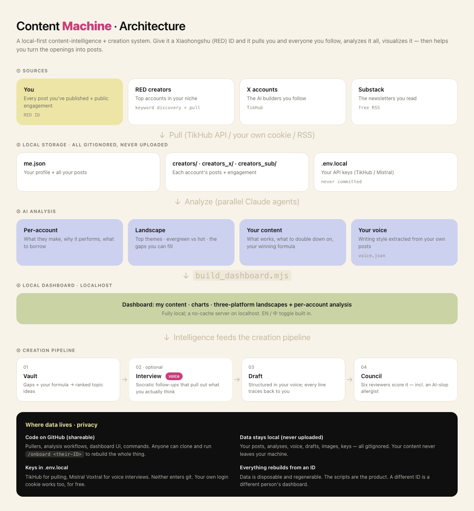

# Content Machine（增强版）

> 本项目基于 [zixi-liu/content_machine](https://github.com/zixi-liu/content_machine)（MIT 协议）二次开发。
> 感谢原作者的开源设计——「机器公开、个人私有」的架构让二次创作非常安全。

**本增强版新增（中文本地化 + 自助化改造）：**

- 🇨🇳 **默认中文界面**（原版为中英切换，默认英文偏好问题已修复）
- ⚙️ **数据管理面板**：仪表盘内自助操作，无需 AI 助手在场——一键刷新我的数据 / 粘贴博主链接添加对标 / 按关键词发现创作者 / 实时任务队列与日志
- 🔗 **笔记链接修复**：小红书对无 `xsec_token` 的链接一律显示「当前笔记暂时无法浏览」，本版通过搜索收割令牌自动修复，修不好的转搜索页兜底，不留死链
- 📹 **视频/图文博主切换**：创作者表格按视频占比打标、可筛选
- 🎯 **视频博主过滤器** `xhs_filter_video.mjs` + 多轮关键词发现合并累积
- 🌿 **分类规则示例**（治愈生活方式赛道），按 `scripts/build_dashboard.mjs` 顶部注释可改成任何赛道

---

A six-step Claude Code system that turns your raw thinking into publishable posts — without
the AI slop. Adapted from [Alex Lieberman's workflow](https://www.chatprd.ai/how-i-ai/alex-liebermans-6-step-workflow-to-beat-ai-slop)
(founder of Morning Brew, now Tenex), as covered on Lenny's Newsletter's *How I AI*.



<sub>中文版架构图见 [docs/architecture.png](docs/architecture.png)</sub>

## The idea

Most people use AI backwards: they ask it to write *about* a topic, and get back the average
of the internet. This system never asks the model for an opinion. It interviews you until
you've said something worth publishing, then structures what you actually said.

> "AI slop is hilariously people just pointing the finger at themselves and saying,
> 'I'm not intelligent enough.'" — Alex Lieberman

The leverage is in **step 2**, not step 3. Drafting is the easy part.

## Two halves: intelligence + creation

This repo grew a second half — a **source-intelligence dashboard**. Give it a 小红书 ID (plus
optional X handles and Substack feeds) and it pulls, analyzes, and visualizes:

- **Your own content** — every post with engagement, auto-categorized, trend charts, and an
  AI content analysis (what works, what to cut, your winning formula)
- **小红书 / X / Substack sources** — per-account analysis + a cross-account *landscape* for
  each platform (top themes, 常青 vs 热点 topics, and the gaps you're positioned to fill)

That intelligence then feeds the creation pipeline: **Vault** (ranked ideas) → **Draft** (in
your voice) → **Council** (six reviewers score it).

**It's all regenerable from an ID.** The scripts are the machinery; the pulled data is
disposable and gitignored. Clone this repo, run `/onboard <your-id>`, and it rebuilds the
whole dashboard for *your* account.

```bash
node scripts/xhs_me.mjs <your-xhs-id>       # pull your content
node scripts/xhs_discover.mjs               # find creators in your niche
node scripts/x_creator.mjs --list           # pull X builders
node scripts/substack_creator.mjs --list    # pull Substack feeds
# …analyze (Claude agents), then:
node scripts/build_dashboard.mjs            # build
node scripts/serve.mjs                       # → http://localhost:8420
```

See `.claude/commands/onboard.md` for the full flow. The pullers in this repo happen to be
built on a third-party data API (TikHub — that's just how this implementation does it, not an
endorsement; swap in your own data source, or use your own login cookie). Substack is plain RSS.

## Setup

```bash
git clone <this-repo> && cd content_machine
./scripts/init.sh        # creates your private working copies from templates
claude
```

## 中文快速上手（增强版）

```bash
git clone git@github.com:mufeiyu0424/amu-content-machine.git
cd amu-content-machine
./scripts/init.sh                 # 从模板生成你的私有工作文件（已被 gitignore）
```

1. **配数据源**：复制 `.env.example` 为 `.env.local`，填入你的 [TikHub](https://tikhub.io) Key（拉小红书/X 数据用，按次计费几美分）
2. **启动仪表盘**：`node scripts/serve.mjs` → 打开 http://localhost:8420
3. **拉你自己的数据**：把你的小红书主页分享链接发给 AI 助手（Claude Code / WorkBuddy 等）跑 onboarding；或在仪表盘「数据管理」面板直接操作
4. **六步创作流水线**：灵感库 → 访谈 → 草稿 → 评审团，在 AI 助手对话里进行
5. 分类规则按你的赛道改：`scripts/build_dashboard.mjs` 顶部的 `CATS` 数组

> 所有拉取的数据、你的声音指南、草稿都不会被 git 追踪——这个仓库只含机器，不含你的隐私。


Then, inside Claude Code:

```
/bootstrap-voice
```

Paste in 10–20 of your best-performing posts. This writes `voice/voice-guide.md` — the file
everything else calibrates against. Then fill in `voice/style-guide.md` by hand (who you are,
what you're promoting, what you'll never say).

One observation from use: the interview step works far better spoken than typed — you say
things out loud that you'd never bother typing. This implementation wires the dashboard's
interview voice input to Mistral's Voxtral for transcription (needs `MISTRAL_API_KEY` in
`.env.local`; that's just how we built it, not an endorsement — swap in any transcription
you like). Typing works fine without any of it, as does whatever dictation tool you already use.

## Daily use

```
/oracle                  # 15 ranked ideas from your inputs, leftovers → vault
/interview <idea>        # six personas interrogate you until specifics emerge
/draft                   # transcript + voice guides → a real post
/council                 # six reviewers score 1-10, auto-revise below 9
/repurpose               # adapt across platforms
```

Optional: the **content-scout** skill (`.claude/skills/content-scout/`) mines your own
sources for topic ideas — your email (requires the claude.ai **Gmail connector**, authorized
via `/mcp` inside Claude Code) and your local Granola meeting exports — and banks them into
the Vault's 📮/🎙️ sections. Everything is read locally; nothing is uploaded.

After you publish:

```
/lessons                 # diff AI draft vs. what you actually posted → new rules
```

That last one is what makes the system compound. Every edit you made by hand becomes a rule
the machine follows next time.

## The six steps

**1. The Oracle** — Scans the last seven days of your inputs (Slack exports, meeting notes,
saved links, your own drafts) for "content spikes" — things you said with unusual energy or
repeated across conversations. Returns 15 ranked ideas. Unused ones go to `vault/ideas.md`.

**2. The Interview Panel** — Six interviewer personas (Tim Ferriss, Joe Rogan, Barbara Walters,
Howard Stern, Michael Barbaro, Larry King) take turns pushing you for specifics. Each has a
different angle of attack. They don't stop until you've given a number, a name, or a story.
Output is a transcript in your own words.

**3. Drafting with Codified Voice** — Claude drafts from the transcript, using
`voice/style-guide.md`, `voice/voice-guide.md`, and `voice/content-lessons.md` as its
instruction manual. It structures your sentences; it doesn't write new ones.

**4. The Writer's Council** — Six reviewer personas (David Perell, Sean Puri, Morgan Housel,
Ann Handley, Nicolas Cole, and an "AI Slop Allergist") independently score the draft 1–10.
Average below 9 triggers an automatic revision using their feedback. Runs as parallel
subagents so scores stay genuinely independent.

**5. The Lessons Loop** — After you publish, the system diffs its final draft against your
published version and proposes generalizable lessons. You approve them, and they append to
`voice/content-lessons.md` permanently.

**6. Repurpose & Distribute** — One command adapts the piece across formats, following
per-platform rules in the voice guide.

## Repository layout

```
content_machine/
├── CLAUDE.md                    # orchestration rules Claude reads every session
├── LICENSE · CONTRIBUTING.md · .env.example
├── .claude/
│   ├── commands/                # the six steps + onboard/scan/cover
│   ├── agents/                  # council members as parallel subagents
│   └── skills/content-scout/    # mine your email + meeting notes for ideas
├── scripts/                     # dependency-free Node: pullers, digests,
│   │                            #   build_dashboard, serve, cover, init.sh
├── dashboard/index.html         # local dashboard UI (data files gitignored)
├── voice/*.template.md          # style/voice/lessons templates
│                                #   (your filled-in copies stay local)
├── personas/
│   ├── interview-panel.md       # the six interviewers
│   └── writers-council.md       # the six reviewers + rubric
├── sources/                     # public account lists (your notes → *.local.md)
├── docs/architecture*.png       # the diagrams above (EN + 中文)
├── inputs/                      # raw material for the Oracle (local)
├── vault/ideas.template.md      # idea backlog: /oracle + 📮 email + 🎙️ meetings
├── drafts/                      # one folder per piece in progress (local)
└── published/                   # what actually went out (local)
```

## What's public and what isn't

This repo is designed to be forked and shared, so the split matters. Anything personal lives
in a gitignored working copy created from a tracked template by `scripts/init.sh`.

**Public** — the framework (`CLAUDE.md`, commands, agents, `personas/`, `scripts/`), the empty
`voice/*.template.md` files, and the curated source lists in `sources/`. Those lists are public
accounts and public engagement numbers, and they're most of what makes this repo useful to
someone else.

**Private** — your filled-in voice guides, your annotations on the source lists, and all your
material (`inputs/`, `drafts/`, `published/`, `vault/`).

The one worth understanding: `voice/voice-guide.md` is both the most personal file here and the
engine of the whole system. It's gitignored. Its template isn't. Don't edit templates in place.

Your `⚡` marks on source accounts — "this person is right but missing something" — go in
`sources/*.local.md`, also gitignored. They're useful editorial judgments about named people,
and they don't belong in a public repo under your name.

## Contributing

PRs welcome — see [CONTRIBUTING.md](CONTRIBUTING.md). The short version: the machinery
(scripts, commands, skills, dashboard code) is public; anything personal (voice guides,
pulled data, ideas, drafts) is gitignored and must never appear in a PR.

## License

[MIT](LICENSE).

## Credits

System design by [Alex Lieberman](https://alexlieberman.com). Documented by
[ChatPRD's How I AI](https://www.chatprd.ai/how-i-ai) and
[Lenny's Newsletter](https://www.lennysnewsletter.com/p/how-i-ai-how-the-founder-of-morning).
This repo is an independent Claude Code implementation of the publicly described workflow.
